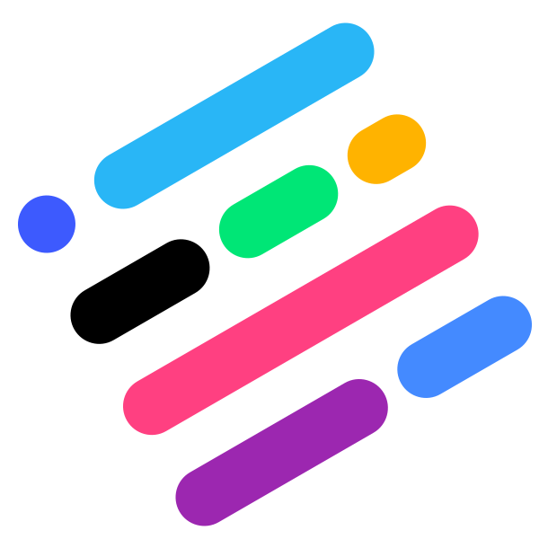

<!-- Project Logo -->


<!-- Main Header Links -->
<div align="right"><a href="https://itunes.apple.com/us/app/apple-store/id375380948?mt=8" target="_blank">

</a>
<a href="https://play.google.com/store/apps/details?id=com.google.android.googlequicksearchbox" target="_blank">

</a></div>

<!-- Project Title -->
<h1>Nifty App<sup>&#153;</sup></h1>

This is some descriptive text of the overall project. It is really cool and a super fun app to use in your daily roster. You should totally give this awesome collection of code a try! It will rock your world!

<!-- Shields -->
<p align="center">


<a href="https://beerpay.io/" target="_blank">
  
</a>
<a href="https://itunes.apple.com/us/app/apple-store/id375380948?mt=8" target="_blank">
  
</a>
</p>


# Screenshots
Screenshots are the quickest way to captivate your audience and let them know what your app is about. Make those seconds count here and in the App Store with some great graphics.

# Setup
#### Step 1. Retrieve the Submodules
```
git submodule sync
git submodule update --init --recursive
```

#### Step 2. Choose the Environment within Xcode
Click Scheme Dropdown > **Edit Scheme... > Build Configuration** Dropdown > Preferred Environment


# Contribution and Distribution
#### Looking to contribute to Nifty?
Pull Requests are welcome!

#### Distribution
Nifty's source code is for education purposes and should not be redistributed on other sites. If you'd like to know more about distribution or have questions feel free to [email us](mailto:someone@example.com).


# License
It's a good idea to attach a license to an App Store project which is also open source. Check out [this article](http://blog.lazerwalker.com/cortado/2015/07/05/open-source-licenses.html) which gives a great overview on app licensing.


# Comments | Questions | Complements
You can [email us](mailto:someone@example.com) anytime for comments and questions. Let us know how you use Nifty and what we can do to make it better!

<a href="https://beerpay.io/" target="_blank">Buy us a beer.</a>
